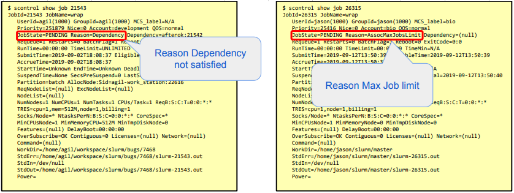

# FAQ
<!-- blank line -->
* **Why my job is not running?**   

    * Use the next command to see the reason:  
          $ scontrol show job <job-id>
    * The reason can be:  
        * priority => resources being reserved for higher priority job.
        * resources => required resources are in user.
        * dependency => job dependencies not yet satisfied.
        * reservation => waiting for advanced reservation.
        * AssociationJobLimit => user account job limit reached.
        * AssociationResourceLimit => user account resource limit reached.
        * AssociationTimeLimit => user account time limit reached.
        * QOSJobLimit => Quality Of Service (QOS) job limit reached.
        * QOSResourceLimit => Quality Of Service (QOS) resource limit reached.
        * QOSTimeLimit => Quality Of Service (QOS) time limit reached.
     * Example:
     
<!-- blank line -->

* **Why my job was killed?**  
     * Use  #SBATCH --requeue option in your Batch File.  
<!-- blank line -->

* **Why sstat doesn't show the used resources of my completed job?**
     * sstat command need be used for the _running_ job_id.
     * for completed jobs use sacct command.
<!-- blank line -->

* **Why sacct doesn't show the used resources of my running job?**  
      * sacct command need be used for the _completed_ job_id.
      * for the running jobs use sstat command.
      * sacct  command need to run on the master node only, so to execute it it need be written in the script.  
<!-- blank line -->
