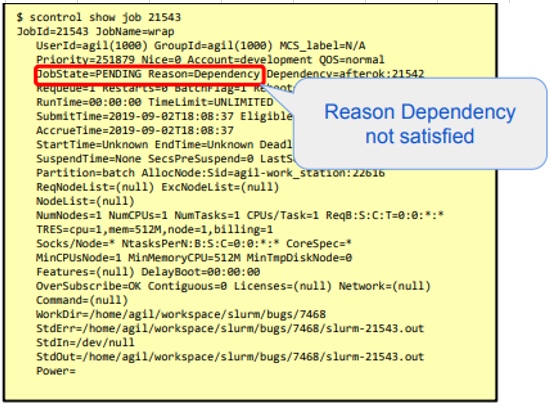
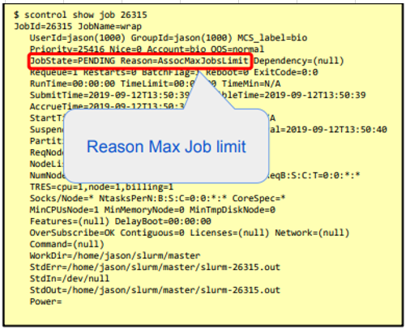
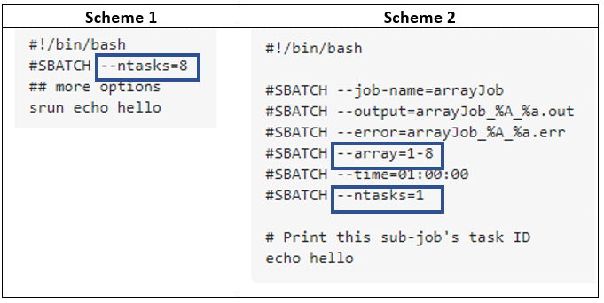

# FAQ
<!-- blank line -->

### **Why my job is not running?**   

Use the next command to see the reason:  

    $ scontrol show job <job-id>

The reason can be:  

  * priority => resources being reserved for higher priority job.
  * resources => required resources are in user.
  * dependency => job dependencies not yet satisfied.
  * reservation => waiting for advanced reservation.
  * AssociationJobLimit => user account job limit reached.
  * AssociationResourceLimit => user account resource limit reached.
  * AssociationTimeLimit => user account time limit reached.
  * QOSJobLimit => Quality Of Service (QOS) job limit reached.
  * QOSResourceLimit => Quality Of Service (QOS) resource limit reached.
  * QOSTimeLimit => Quality Of Service (QOS) time limit reached.
  * Example:  
  
  
<!-- blank line -->

### **Why my job was killed?**  
Use the SBatch Flag below in your Batch File.

    #SBATCH --requeue   
<!-- blank line -->

### **Why sstat doesn't work?**
  * sstat command need be used for the _running_ job_id.
  * for completed jobs use sacct command.
<!-- blank line -->

### **Why sacct doesn't work?**  
  * sacct command need be used for the _completed_ job_id.
  * for the running jobs use sstat command.
  * sacct  command need to run on the master node only, so to execute it it need be written in the script.  
<!-- blank line -->

###**What to choose --ntasks or --array?**

<!-- blank line -->

Let's review two schemes: in the first one we are defining one job with 8 tasks: "srun echo hello".
In the second scheme: we reserve in Slurm one job with one task and array = 1-8. So what is the difference between these two options?  
<!-- blank line -->

In the Scheme 1: all the tasks will be scheduled at the _same time_.  So it will need 8 CPUS to become available at the same time. This is typically only used with parallel jobs where processes need to communicate with each others, for instance using an Message Passing Interface library.  
<!-- blank line -->

In the Scheme 2: the 8 tasks will be scheduled _independently_ one of another. If 8 CPUs become available at once, they will all start at the same time, but if only 4 CPUs become available at first, 4 tasks will run, the other 4 remaining pending.  It is typically used in the case of embarrassingly parallel jobs, where the processes do not need to communicate or synchronize, like for applying the same program to a list of files.  

###**How to know if I am working with GPU or CPU?**
In order to test if your GPU is in use and working please run the next [scrip](http://gpu.bgu.ac.il/examples/) from BGU ISE web site.
