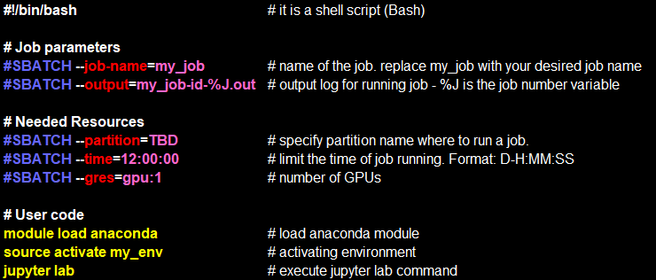

# SBatch
  #SBATCH - Bash "sees" this as comment. 
  #SBATCH - Bash "sees" this as comment. 
  #SBATCH - Slurm "takes" them as parameter. 
  Use ## to close #SBATCH as comment. 

## Example of SBatch Script
  

## Flags Description

| **Flag** 
property
 | **Description** 
property
 | **Default** |
|:----------------|:-------------|:---------------|
| | | |
| #SBATCH --partition=<ins>TBD</ins> | Partition name.  | <ins>TBD</ins> |  
| | | |
| #SBATCH --time=0-12:00:00 | Limit the time of job running. Format: D-H:MM:SS.  | <ins>TBD</ins> |
| | | |
| #SBATCH --job-name=my_job | Name of the job. Replace my_job with your desired job name. | |   
| | | |
| #SBATCH --output=%a_my_name-%J.out| Output log for running job, %J – job #, %a – run #.| |    
| | | |
| #SBATCH --mail-user=username@post.bgu.ac.il| Users email for sending job status notifications.| |
| | | |
| #SBATCH --mail-type=BEGIN,END,FAIL| Conditions when to send the email. ALL,BEGIN,END,FAIL, REQUEU, NONE.| |  
| | | |
| #SBATCH --nodelist=<ins>TBD</ins>  | Specify the computer to run the job. | <ins>TBD</ins> |  
| | | |
| #SBATCH --array=1-10  | Run parallel 10 times. | <ins>TBD</ins> |
| | | |
| #SBATCH --mem=72G  | Allocate extra memory. | <ins>TBD</ins> |
| | | |
| #SBATCH --gres=gpu:1  | Number of GPUs (can't exceed 8 gpus for now) ask for more than 1 only if you can parallelize your code for multi GPU. | <ins>TBD</ins> |
| | | |
| #SBATCH --nodes=1-1 | Allocate 1 node. | <ins>TBD</ins> |
| | | |
| #SBATCH --ntasks=12  |Allocate 12 tasks| <ins>TBD</ins> |
| | | |
| #SBATCH --cpus-per-task=32  |Allocate extra CPU: 32 CPU per task.| <ins>TBD</ins> |
| | | |
| #SBATCH --requeue=32  |Re-run the task if it was preempted.| <ins>TBD</ins> |
| | | |
| #SBATCH --dependency=after(ok/notok/any):<job_ids>  |Ordering of jobs.| <ins>TBD</ins> |
| | | |
| #SBATCH --exclusive=<user>  |To reserve a whole node for yourself, slurm will reserve a full node for the first job to start in the array, and then will schedule all the others on the same machine as only your jobs will be allowed there.| <ins>TBD</ins> |
| | | |
| #SBATCH %j  |Job #.| |
| | | |
| #SBATCH %A  |Value of SLURM_ARRAY_JOB_ID.| |
| | | |
| #SBATCH %a  |Value of SLURM_ARRAY_TASK_ID.| |

 

## Submit Job
    $ sbatch ./submit.sh
    $ sbatch --qos=name ./submit.sh

## Cancel Job

    $ cancel <job-id>
