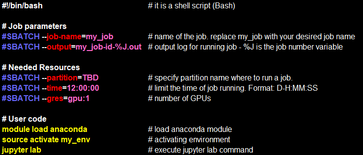

# SBATCH
  The syntax for the SLURM directive in a script is  "#SBATCH < flag >".  Some of the flags are used with the srun and salloc commands, as well as the fisbatch wrapper script for interactive jobs. Sbatch configuration parameters must start with #SBATCH and must precede any other command.
  #SBATCH - Bash "sees" this as comment. 
  #SBATCH - Slurm "takes" this as parameter.   
  Use ## to close #SBATCH as comment. 

### Example of SBatch Submition Script (Batch File):

  **NOTE**: the term "Batch File" is used throughout this documentation to mean an executable file that you create and submit to the job scheduler to run on a node or collection of nodes.  This script will include a list of Slurm directives (or commands) to tell the job scheduler what to do.  

  

### Additional Flags' Description

| **Flag** 
property
 | **Description** 
property
 | **Default** |
|:----------------|:-------------|:---------------|
| | | |
| #SBATCH --partition=<ins>TBD</ins> | Partition name.  | <ins>TBD</ins> |  
| | | |
| #SBATCH --time=0-12:00:00 | Limit the time of job running. Format: D-H:MM:SS.  | <ins>TBD</ins> |
| | | |
| #SBATCH --job-name=my_job | Name of the job. Replace my_job with your desired job name. | |   
| | | |
| #SBATCH --output=%a_my_name-%J.out| Output log for running job, %J – job #, %a – run #.| |    
| | | |
| #SBATCH --mail-user=username@post.bgu.ac.il| Users email for sending job status notifications.| |
| | | |
| #SBATCH --mail-type=BEGIN,END,FAIL| Conditions when to send the email. ALL,BEGIN,END,FAIL, REQUEU, NONE.| |  
| | | |
| #SBATCH --nodelist=<ins>TBD</ins>  | Specify the computer to run the job. | <ins>TBD</ins> |  
| | | |
| #SBATCH --array=1-10  | Run parallel 10 times. | <ins>TBD</ins> |
| | | |
| #SBATCH --mem=72G  | Allocate extra memory. | <ins>TBD</ins> |
| | | |
| #SBATCH --gres=gpu:1  | Number of GPUs (can't exceed 8 gpus for now) ask for more than 1 only if you can parallelize your code for multi GPU. | <ins>TBD</ins> |
| | | |
| #SBATCH --nodes=1-1 | Allocate 1 node. | <ins>TBD</ins> |
| | | |
| #SBATCH --ntasks=12  |Allocate 12 tasks| <ins>TBD</ins> |
| | | |
| #SBATCH --cpus-per-task=32  |Allocate extra CPU: 32 CPU per task.| <ins>TBD</ins> |
| | | |
| #SBATCH --requeue=32  |Re-run the task if it was preempted.| <ins>TBD</ins> |
| | | |
| #SBATCH --dependency=after(ok/notok/any):<job_ids>  |Ordering of jobs.| <ins>TBD</ins> |
| | | |
| #SBATCH --exclusive=<user>  |To reserve a whole node for yourself, slurm will reserve a full node for the first job to start in the array, and then will schedule all the others on the same machine as only your jobs will be allowed there.| <ins>TBD</ins> |
| | | |
| #SBATCH %j  |Job #.| |
| | | |
| #SBATCH %A  |Value of SLURM_ARRAY_JOB_ID.| |
| | | |
| #SBATCH %a  |Value of SLURM_ARRAY_TASK_ID.| |

 

### Submit Job

    $ sbatch <path-to-file>/<sbatch-file-name>

If you have QOS privileges, you can use:

    $ sbatch --qos=<priority-user-name> <path-to-file>/<sbatch-file-name>

After job submission, Slurm gives the JobID, to see it use:

    $ ls -lrt

### Cancel Job
Cancel the specific job:

    $ scancel <job-id>
or

    $ scancel --name <job-name>  

Cancel all jobs of the user:

    $ scancel -u<user-name>
    or
    $ scancel -u$USER

Cancel pending jobs of the user:

    $ scancel -t PENDING -u <user-name>

### View Job ID and it's Status

    $ squeue -l -u$USER  
or  

    $ squeue -l -u<user-name>  

For codes of job state description please use:

    $ man squeue

Some of them are:  

   * R  - running  
   * PD - pending    
   * CA - canceled  
   * CD - completed  
   * F  - failed  
