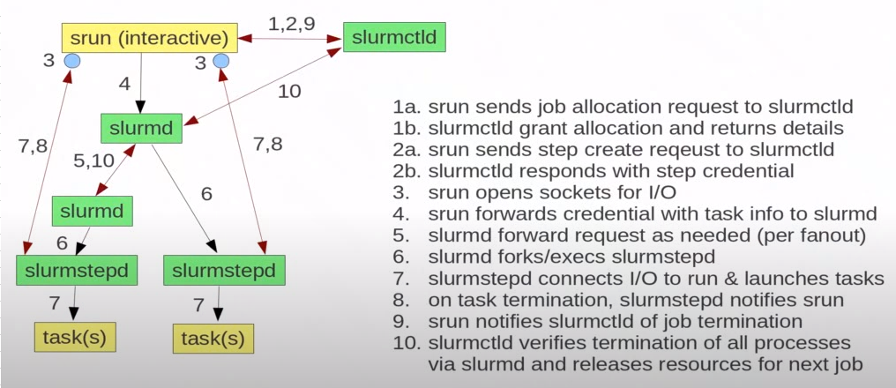

# SRUN

Slurm jobs are normally batch jobs in the sense that they are run unattended. If I need iterative bash session you can use srun option.  

    $ srun --mem=32G --cpus-per-task=6 -n 4 <command>
    or
    $ srun --mem=32G --cpus-per-task=6 -n 4 <path-to-file>/<file-name>

The next brief explanation of srun evaluation was taken from Slurm home page:  

See the next [link](https://slurm.schedmd.com/srun.html) about srun details.
